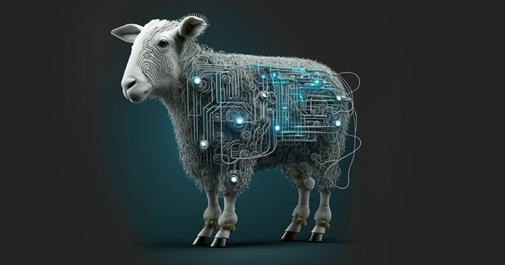
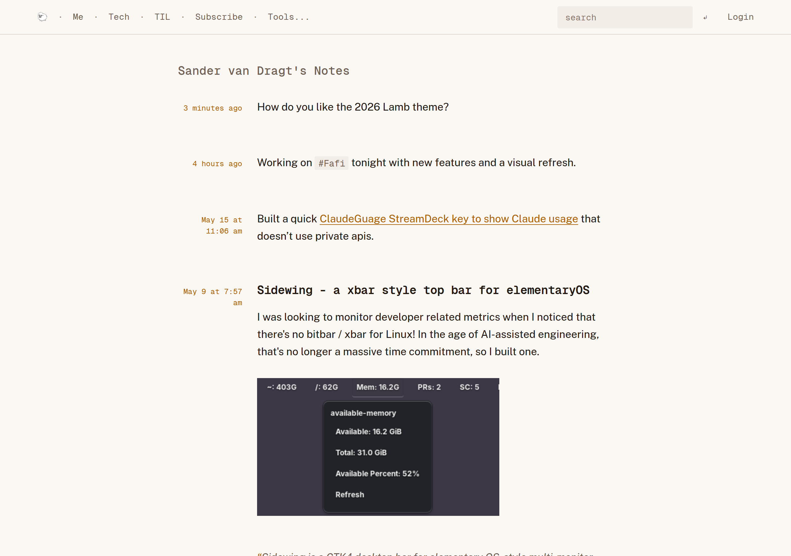

Lamb — Literally Another Micro Blog.

Barrier free super simple blogging, self-hosted.

- SQLite based portable single author blog.
- Friction
  free [Markdown](https://docs.github.com/en/get-started/writing-on-github/getting-started-with-writing-and-formatting-on-github/basic-writing-and-formatting-syntax)
  entry, with drag and drop image support.
- Hashtags support, by just typing them `#ahyeah`.
- Drafts, scheduled posts, and friction free trash with restore.
- Discoverable Atom feeds (`/feed`, plus a feed per tag).
- Pull external content into the blog by subscribing to feeds; ingested posts land as drafts by default.
- Publish from other apps through a Micropub endpoint.
- Full text search and configurable menu items.
- 404 fallback redirection to your old site, plus automatic 301s when a post's slug changes.
- Friendly user theming, if you don't like my retro themes. ;)

# Getting started

[Read the documentation](https://svandragt.github.io/lamb) to get started.

# Screenshots

An example blog running the 2026 theme at [vandragt.com](https://vandragt.com):

Dropping images into a post ala GitHub:

Friction free post deletion:
[Friction free post deletion (video)](https://github.com/svandragt/lamb/assets/594871/d0178b48-9a62-4e5d-bab7-b8168485be1e)

# Philosophy

- Simple over complex.
- Opinionated defaults over settings.
- Assume success, communicate failure.

