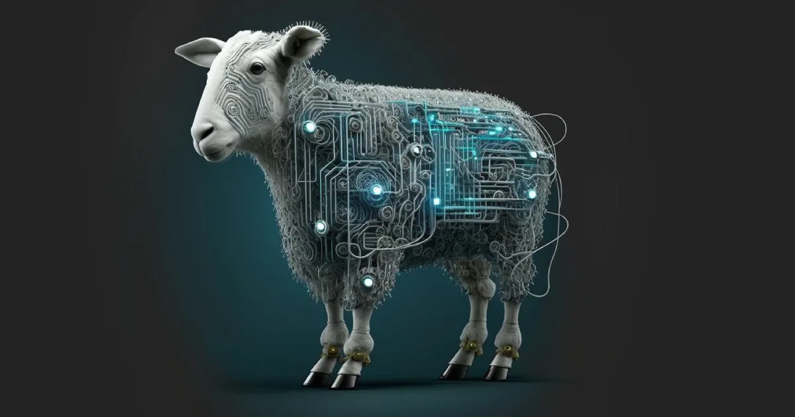
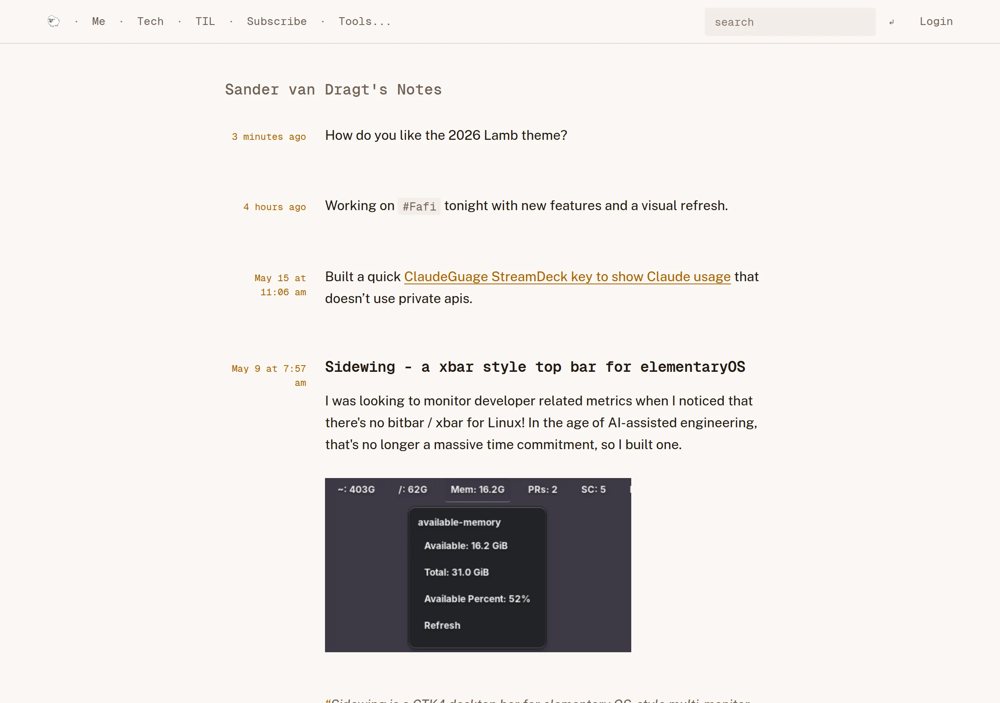

Lamb — Literally Another Micro Blog.

Barrier free super simple blogging, self-hosted.

- Drag or paste an image and Lamb converts it to WebP automatically. There's no upload step and no asset library to manage.
- Tag posts by typing `#hashtag` inline. There's no taxonomy UI, and the tags just appear.
- Full-text search is included. You don't need a plugin, and there's nothing to rebuild.
- Lamb runs on SQLite, so your entire blog is one file: straightforward to back up and to move.
- Drafts and scheduled posts are built in, with one-click trash and restore.
- A [Micropub](https://indieweb.org/Micropub) endpoint lets you post from iA Writer, Ulysses, or any IndieWeb-compatible app.
- One-click export gives you every post as plain Markdown files plus their images, so your writing is never locked in.

# Get started

[Read the documentation](https://svandragt.github.io/lamb) to get started. It's published from the `release`
branch, so it always matches the latest released version.

To preview the in-development docs on `main` locally, run `make docs` and open http://localhost:4000/lamb/.

# Screenshots

An example blog running the 2026 theme at [vandragt.com](https://vandragt.com):

Dropping images into a post, GitHub-style:

Friction-free post deletion:
[Friction-free post deletion (video)](https://github.com/svandragt/lamb/assets/594871/d0178b48-9a62-4e5d-bab7-b8168485be1e)

# Philosophy

- Simple over complex.
- Opinionated defaults over settings.
- Assume success, communicate failure.

