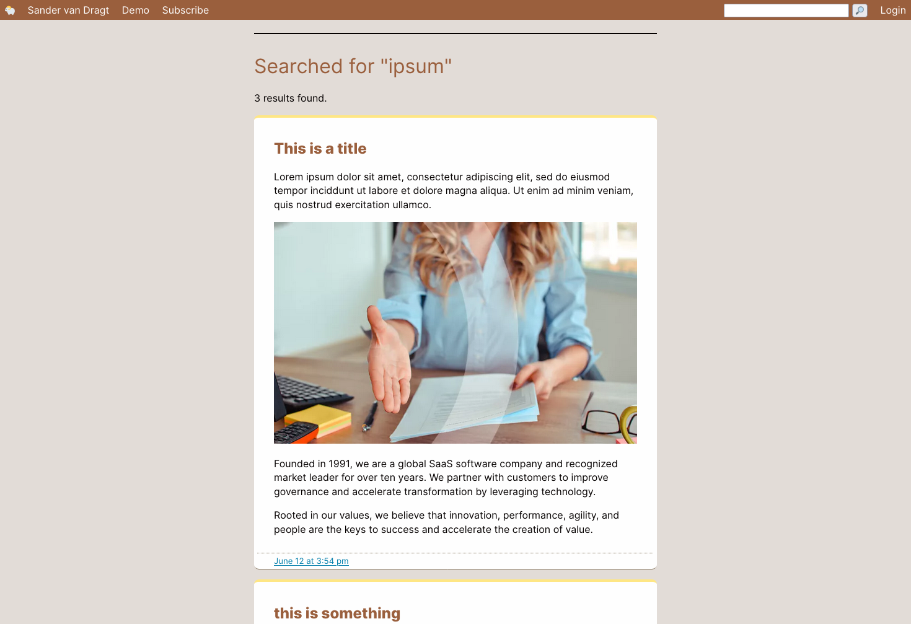
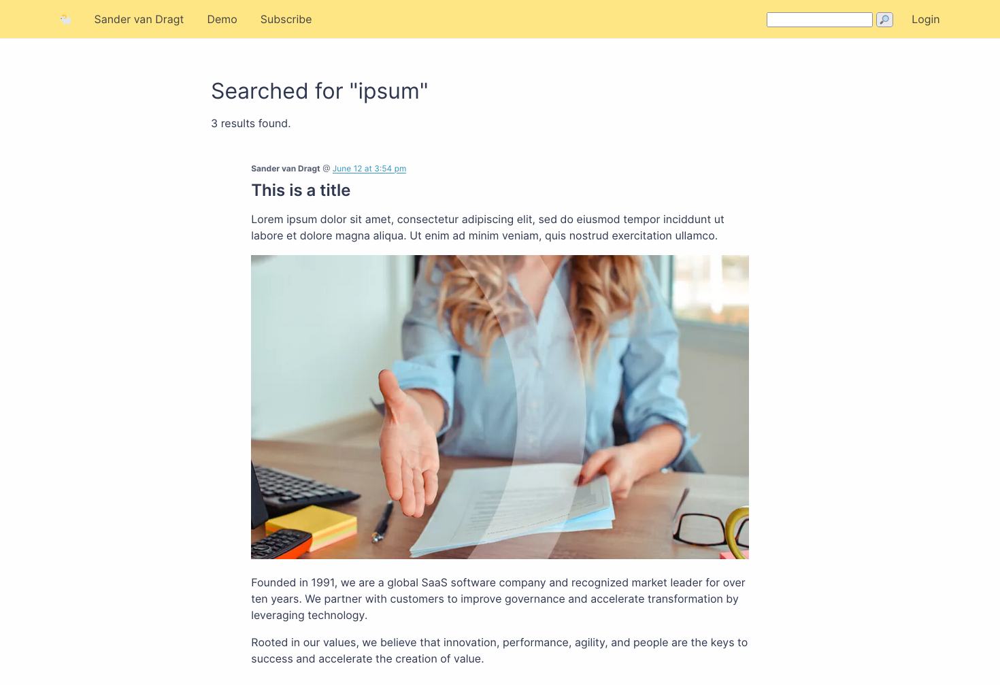

# Themes

Lamb comes with two built in themes: `default` and `2024`.

I'm not a designer.

* _Default_ is a traditional blog theme
* _2024_ is a more open modern theme. It's build on top of default.

To switch between themes assign the theme directory as the value to the `theme` key in the `config.ini`:

```ini
theme = 2024
```

Lamb also supports user themes in the same way. Simply create your own theme directory and assign it to the `theme` key.

## Screenshots

Default:


---

2024:


## Theme documentation

* All functions available in theme.php can be reused in the theme.
* A theme requires a `html.php` containing the general HTML layout, and a `feed.php` file containing a feed xml file.
* Use the `part($basename)` function to load any other theme includes. This enables a fallback to the default theme's
  files if the file does not exist in the theme. This makes the default theme is a requirement for the 2024 theme.
* CSS stylesheets must be saved in a subfolder of the theme called `styles/` and loaded using `the_styles($array)`. (the
  argument is TODO)
* JS scripts must be saved in a subfolder of the theme called `scripts/` and loaded using `the_scripts($array)`. (The
  argument is TODO)

Have a look at the pre-existing themes for examples of the above.

Any suggestions to improve theming are welcomed.
