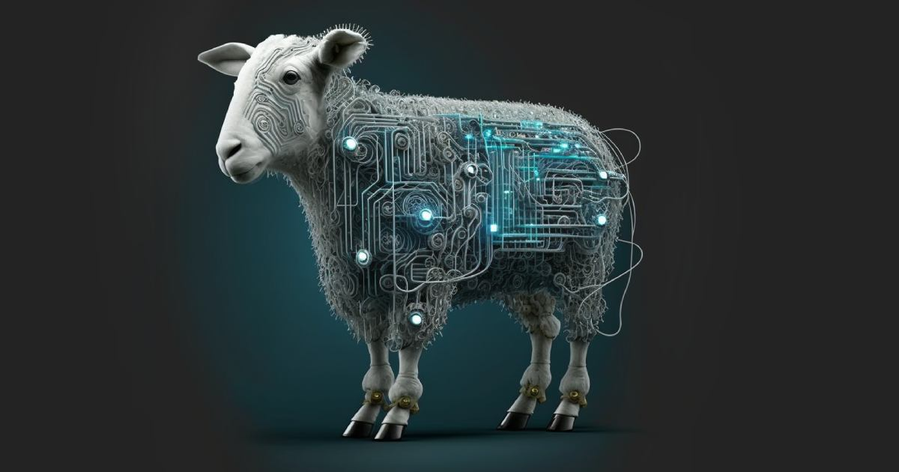

Lamb - Literally Another Micro Blog.

Barrier free super simple blogging, self-hosted.

- SQLite based portable single author blog
- Twitter like interface
- Friction free [Markdown](https://docs.github.com/en/get-started/writing-on-github/getting-started-with-writing-and-formatting-on-github/basic-writing-and-formatting-syntax) entry, with drag and drop image support.
- Generates a discoverable Atom feed (/feed)
- Hashtags support, by just typing them.
- 404 fallback url feature (redirects 404's relative urls to another site).

# Getting started

```
# checkout project
git clone https://github.com/svandragt/lamb.git
cd lamb
```

Lamb can be run locally with the builtin PHP webserver, here are two ways to set this up:

1. [Devbox](https://jetpack.io/devbox/docs/contributor-quickstart/), OR
2. locally install [PHP 8.1](https://www.php.net/manual/en/install.php) and
[composer](https://getcomposer.org/doc/00-intro.md#installation-linux-unix-macos).

## 1. Devbox
```shell
devbox shell
composer install
```

## 2. Locally installed PHP and Composer

```shell
# Install required system packages, for example on Debian Linux derivates like Ubuntu
sudo apt update
sudo apt install php8.2 php8.2-gettext php8.2-mbstring php8.2-sqlite3 php8.2 php8.2-xml composer

# install project packages
composer install
```

## Run Lamb
To Run:

```shell
LAMB_LOGIN_PASSWORD=$(php make_password_hash.php hackme) composer serve
```
Change `hackme` to something more secure, this is the `/login` password!

Support for [Docker](docs/docker.md), [Caddy](docs/caddy.md) and [NGINX](docs/nginx.md) is also provided.

# Site Configuration (optional)

Add a `src/config.ini` file with the following contents and update any of the following lines after
uncommenting them:

```ini
;author_email = joe.sheeple@example.com
;author_name = Joe Sheeple
;site_title = My Microblog
;404_fallback = https://my.oldsite.com
```

# Screenshots
An example blog with the default theme:


Dropping images into a post ala GitHub:


Friction free post deletion:
[Friction free post deletion (video)](https://github.com/svandragt/lamb/assets/594871/d0178b48-9a62-4e5d-bab7-b8168485be1e)


# Philosophy

- Simple over complex.
- Opinionated defaults over settings.
- Assume success, communicate failure.

[](https://jetpack.io/devbox/docs/contributor-quickstart/)
